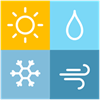

#  Weather Dashboard

## 🌐 Overview
A responsive web app providing real-time weather data for any city in the world. Built with React and Tailwind CSS, it allows users to conveniently check the weather of any location worldwide.

## 🌍 Live Demo
Check out a live demo of the application <a href="https://tohid-weather-dashboard.netlify.app/">here</a>

## ✨ Features
- **Current Weather**: Provides real time weather information, including temperature, weather condition in both text and image.
- **Search Functionality**: Users can search for cities worldwide.
- **Favorites List with Persistence**: Save city names, allowing to see their real time weather information just by clicking on them, and saved cities remained accessible across sessions via localStorage.
- **Unit Conversion**: Toggle between Celsius and Fahrenheit temperature units
- **Responsive design**: Optimized for both desktop and mobile devices.

## 🛠️ Tech Stack
- **Frontend Framework**: React
- **State Management**: React Context API
- **Styling**: Tailwind CSS
- **Build Tools**: Node.js, npm
- **API Integration**: OpenWeatherMap
- **Deployment**: <a href="https://www.netlify.com">Netlify</a>

## 🚀 Installation
### Prerequisites
- Node.js (v14 or above recommended)
- NPM or Yarn

### Steps
1. **Clone the repository**:
```bash
git clone https://github.com/hasantohidul/weather-dashboard.git
cd weather-dashboard
```
2. **Install Dependencies**:
```bash
npm install
```
3. **API Key Setup**:
- Register and obtain an API key from a weather service provider (such as OpenWeatherMap).
- Create a `.env` file at the root level:
```plaintext
REACT_APP_WEATHER_API_KEY=your_api_key
```
4. **Run the Application**:
```bash
npm start
```
The application will open in your browser at `http://localhost:3000`.

## 📖 Usage
- **City Search**: Enter a city name to retrieve its current weather conditions.
- **Save Favorite Cities**: Add cities to a favorites list for quick access. The city names are saved locally, so they remain available across sessions.
- **Switch Units**: Toggle between Celsius and Fahrenheit temperature units.

## 📂 Project Structure

```plaintext
weather-dashboard
├─ .gitignore
├─ package-lock.json
├─ package.json
├─ postcss.config.js
├─ public
│  ├─ favicon.ico
│  ├─ index.html
│  ├─ logo-192.png
│  ├─ logo-512.png
│  ├─ manifest.json
│  └─ robots.txt
├─ README.md
├─ src
│  ├─ App.css
│  ├─ App.jsx
│  ├─ App.test.js
│  ├─ assets
│  │  └─ app-logo.png
│  ├─ components
│  │  ├─ Header.jsx
│  │  ├─ SearchBar.jsx
│  │  ├─ UnitToggle.jsx
│  │  └─ WeatherCard.jsx
│  ├─ context
│  │  └─ WeatherContext.jsx
│  ├─ index.css
│  ├─ index.js
│  ├─ logo.svg
│  ├─ pages
│  │  ├─ Favorites.jsx
│  │  └─ Home.jsx
│  ├─ services
│  │  └─ weatherService.js
│  └─ setupTests.js
└─ tailwind.config.js
```

## 🤝 Contributing
Contributions are welcome! Feel free to fork the repository, make improvements, and submit a pull request

## 📄 License
This project is licensed under the MIT License.